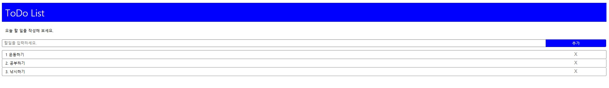

  
 <h1 style="font-size: 2.5em; color: #282d33; text-align: center;">JavaScript 기초부터 고급 기능까지 학습할 수 있는 종합 실습 프로젝트입니다.</h1> 
 기본 문법, 함수, 객체, DOM 조작, 이벤트 처리, 비동기 처리 등 다양한 내용을 포함하고 있습니다. 

📚 목차

💡 프로젝트 소개

🗂️ 프로젝트 구조

🛠️ 사용한 기술

📖 챕터별 설명

🚀 실행 방법

🖼️ 스크린샷

🤝 기여 방법

📄 라이센스

<h2 style="font-size: 2em; border-bottom: 2px solid #d8dee4; color: #282d33;">💡 프로젝트 소개</h2> 

 이 프로젝트는 **JavaScript 학습자**를 위한 실습 자료입니다.   JavaScript의 기본 문법부터 시작해, DOM 조작, 이벤트 처리, 비동기 처리 등의 다양한 내용을 실습합니다. 
 
<h2 style="font-size: 2em; border-bottom: 2px solid #d8dee4; color: #282d33;">🗂️ 프로젝트 구조</h2> <pre style="font-size: 1.1em;">
  JAVASCRIPT/ 
  
  ├── ch01/ # JavaScript 기본 학습
  
  
  │ └── hello.html
  
  ├── ch02/ # JavaScript 기초 문법 
  
  
  │ ├── 1.변수.html 
  
  │ ├── 2.연산자.html
  
  │ ├── 3.조건문.html 
  
  │ └── 4.반복문.html
  
  ├── ch03/ # 함수와 배열
  
  
  │ ├── 1.배열.html
  
  │ ├── 2.함수.html 
  
  │ └── 3.내장함수.html

  ├── ch04/ # 객체와 브라우저 객체 모델

  
  │ ├── js/
  
  │ │ └── Account.js
  
  │ ├── 1.객체.html
  
  │ ├── 2.내장객체.html
  
  │ ├── 3.문서객체.html
  
  │ └── 4.브라우저객체.html
  
  ├── ch05/ # 이벤트 처리 

  
  │ ├── 1.이벤트.html
  
  │ ├── 2.이벤트 종류.html
  
  │ ├── 3.이벤트 객체.html
  
  │ └── 4.이벤트 전파.html
  
  ├── ch06/ # 비동기 처리 
  
  
  │ ├── 1.비동기처리.html
  
  │ ├── 2.Promise.html
  
  │ └── 3.JSON.html
  
  ├── todoApp/ # 간단한 To-Do List 프로젝트

  
  ├── index.html # 메인 인덱스 파일 
  
  └── README.md # 프로젝트 설명 파일 </pre>
  
<h2 style="font-size: 2em; border-bottom: 2px solid #d8dee4; color: #282d33;">🛠️ 사용한 기술</h2>

<ul style="font-size: 1.2em; line-height: 1.6;"> <li><b>JavaScript:</b> 브라우저와 Node.js 환경에서 사용되는 프로그래밍 언어</li>
  
  <li><b>HTML5:</b> 웹 페이지 구조 설계</li> <li><b>CSS3:</b> 스타일링과 레이아웃</li> 
  
  <li><b>DOM API:</b> 문서 객체 모델을 사용한 동적 HTML 조작</li> 
  
  <li><b>Fetch API 및 Promise:</b> 비동기 데이터 처리</li> 
</ul>

<h2 style="font-size: 2em; border-bottom: 2px solid #d8dee4; color: #282d33;">📖 챕터별 설명</h2> 

<ul style="font-size: 1.2em; line-height: 1.6;"> 
  <li><b>ch01 - JavaScript 기본 학습:</b> hello.html에서 기본적인 "Hello, World!" 예제입니다.</li>
  
  <li><b>ch02 - JavaScript 기초 문법:</b> 변수, 연산자, 조건문, 반복문 등의 기초 문법을 학습합니다.</li>
  
  <li><b>ch03 - 함수와 배열:</b> 함수 선언 및 호출, 배열과 내장 함수를 학습합니다.</li> 
  
  <li><b>ch04 - 객체와 브라우저 객체 모델:</b> 사용자 정의 객체와 내장 객체, DOM 및 BOM을 학습합니다.</li> 
  
  <li><b>ch05 - 이벤트 처리:</b> 다양한 이벤트 리스너와 이벤트 전파 방식을 학습합니다.</li>
  
  <li><b>ch06 - 비동기 처리:</b> 비동기 함수, Promise, JSON 데이터 처리를 학습합니다.</li>
  
  <li><b>todoApp - 간단한 프로젝트:</b> JavaScript를 활용한 간단한 To-Do List 애플리케이션입니다.</li> 
  
  </ul>
<h2 style="font-size: 2em; border-bottom: 2px solid #d8dee4; color: #282d33;">🖼️ 스크린샷</h2> <h3 style="font-size: 1.5em; color: #282d33;">📌 To-Do List 애플리케이션</h3> 

<h2 style="font-size: 2em; border-bottom: 2px solid #d8dee4; color: #282d33;">🤝 기여 방법</h2> 
 이 프로젝트는 학습 목적으로 만들어졌습니다. Pull Request나 Issue를 통해 개선 제안이 가능하며, 여러분의 의견을 환영합니다! 

<h2 style="font-size: 2em; border-bottom: 2px solid #d8dee4; color: #282d33;">📄 라이센스</h2> 
 이 프로젝트는 MIT 라이센스를 따르며, 자유롭게 사용하실 수 있습니다. 자세한 내용은 LICENSE 파일을 참고하세요. 
 
✨ Happy Coding! ✨

